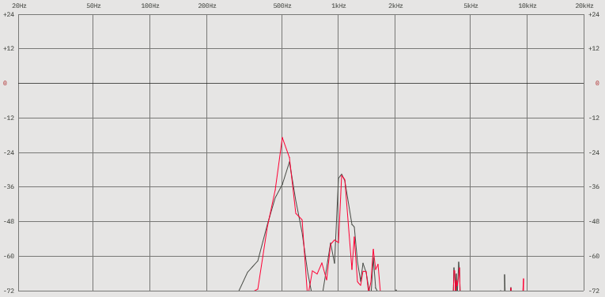
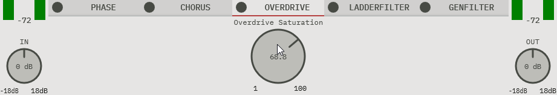

# Modular Multi-Effects Audio Processor

A modular multi-effects audio plugin built with C++20 and the JUCE framework. Includes a range of audio processing modules with a drag and drop interface for real-time effect chain reordering.

## Demo


*ModularFX in action*

### Features in Action

**Drag-and-Drop Module Reordering**


**Real-Time FFT Spectrum Analysis**



**Effect Parameter Manipulation**



## Features

### Audio Processing
- **Chorus** – Depth and rate modulation
- **Phaser** – Phase shifting effect
- **Overdrive** – Saturation
- **Ladder Filter** – Moog-style resonant filtering
- **General Filter** – Peak, Notch, Bandpass, and Allpass modes
- **Input/Output Gain** – Level control with peak metering
- **Real-Time Processing** – Zero-latency, live-ready

### GUI Features
- **Modular Architecture** - Drag and drop module reordering for effect chains
- **FFT Spectrum Analyzer** - Real-time frequency domain visualisation
- **Peak Metering** - Input and output level monitoring
- **State Persistence** - Plugin state is saved with your DAW project
- **UI Design** - Intentionally minimal aesthetic prioritising readability and simplicity 

## Tech Stack

- **Language**: C++20
- **Framework**: JUCE 8.0.6
- **DSP**: JUCE DSP Module
- **GUI Components**: Custom rotary sliders and FFT analyzer via MatKat's SimpleMultiBandComp

## Plugin Formats & Platform Support

### Supported Formats
- VST3
- AU (Audio Units)
- Standalone Application

### Platforms
- Windows 
- macOS 
- Linux 

## Build Instructions

### Prerequisites
- JUCE 8.0.6 (included as submodule)
- MatKat's SimpleMultiBandComp (included as submodule)
- C++ compiler with C++20 support

### Setup

1. **Clone the repository with submodules**
   ```bash
   git clone --recursive https://github.com/l3331l4/Modular-FX.git
   cd Modular-FX
   ```

2. **Initialize submodules** (if not cloned recursively)
   ```bash
   git submodule update --init --recursive
   ```

### Building with Projucer (Recommended)

1. Open the `.jucer` project file in Projucer
2. Set your target platform and plugin formats in the exporter settings
3. Click “Save and Open in IDE”, this will generate the project files and launch your IDE
4. Build the project in your IDE as usual

## Dependencies & Submodules

This project includes two main submodules:

- **JUCE Framework** - Cross-platform C++ framework for audio applications

- **SimpleMultiBandComp** (MatKat) - Provides classes for custom rotary slider and FFT spectrum analyzer UI components
  - *Note: Uses a forked version with custom styling modifications to match the overall UI design*

Both dependencies are managed as Git submodules.  
Make sure to clone the repository with `--recursive` or run `git submodule update --init --recursive` before building.
